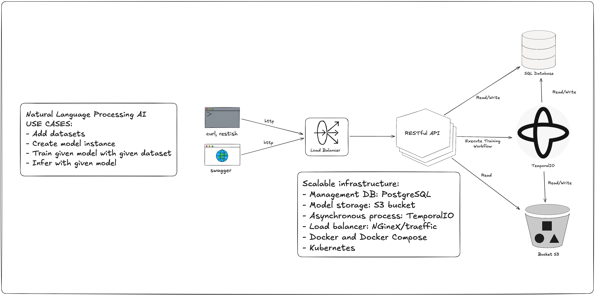
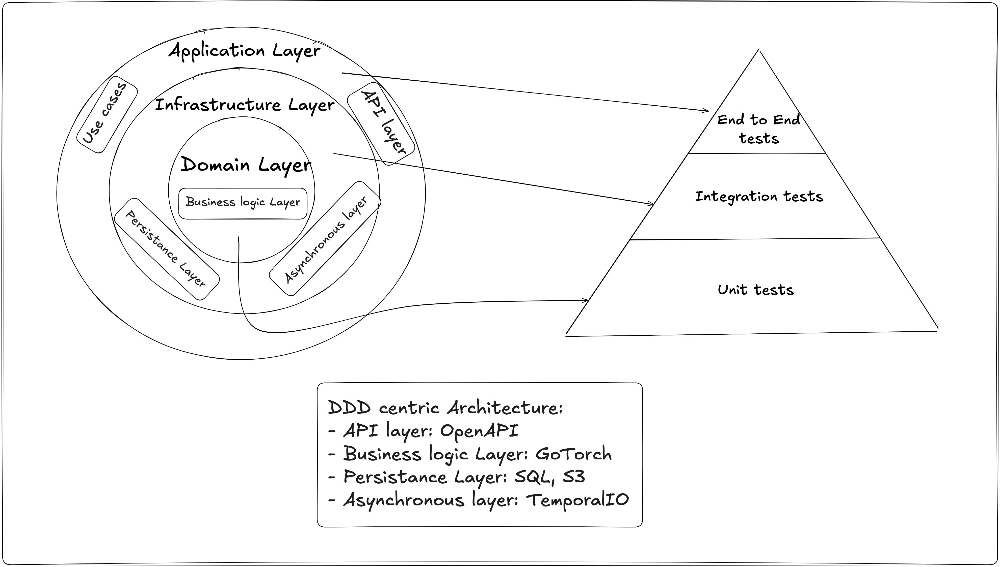
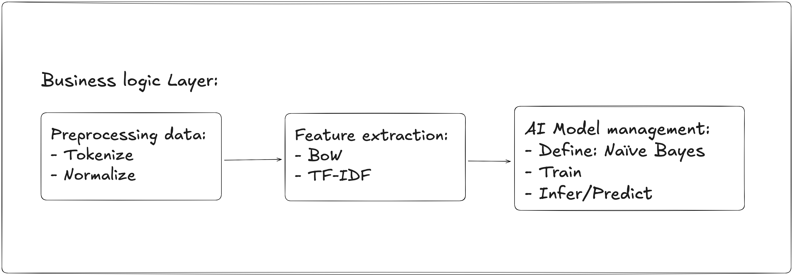

# Naive Bayes Service

## Project Overview

The **Naive Bayes Service** is a scalable REST API designed for hands-on learning in **Go**, **MLOps**, and modern software development practices. The project focuses on building a containerized, modular application with natural language processing capabilities.

## Project Goals

- **Learn Go and MLOps:** Deepen expertise in Go and foundational MLOps concepts.
- **Build a Practical Application:** Create a REST API with machine learning capabilities.
- **Explore DevOps Practices:** Implement CI/CD pipelines, observability, and monitoring.
- **Develop ML Skills:** Train and serve models, starting with Naïve Bayes and progressing to GoTorch.

## System Architecture

### Natural Language Processing AI Use Cases

- Add datasets.
- Create and manage model instances.
- Train models with datasets.
- Infer or predict using trained models.

### Scalable Infrastructure

- **Management DB:** PostgreSQL.
- **Model Storage:** S3 bucket.
- **Asynchronous Processing:** TemporalIO.
- **Load Balancer:** NGineX/Traefik.
- **Deployment Tools:** Docker, Docker Compose, Kubernetes.

## Microservice Architecture

### DDD-Centric Architecture

- **API Layer:** OpenAPI for endpoint management and design.
- **Business Logic Layer:** Core logic implemented with GoTorch.
- **Persistence Layer:** PostgreSQL for relational data and S3 for model storage.
- **Asynchronous Layer:** TemporalIO for managing background processes.

### Business Logic Details

#### Preprocessing Data

- Tokenize and normalize input datasets.

#### Feature Extraction

- Bag-of-Words (BoW) and TF-IDF implementations.

#### AI Model Management

- Define, train, and infer with models like Naïve Bayes.

